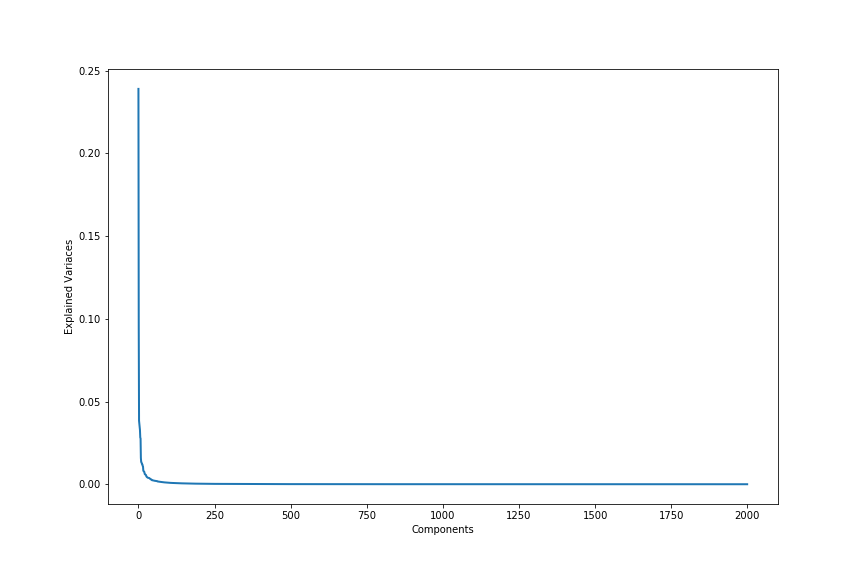

# Process Data

The following module processes downloaded data (from [`1.download-data`](1.download-data)).

## EBImage Feature Processing with Pycytominer

We use [pycytominer](https://github.com/cytomining/pycytominer) to normalize and select meaningful morphology features in the EBImage profiles.

**Note:** The processed output data of this module is already provided in [`2.process-data/data`](https://github.com/cytomining/pycytominer).
Therefore, the following pipeline is optional to reproduce the full analysis.

## Single Cell Image Processing

### Eigenvalues

We also use the eigenvalues of every image.
This is done by interpreting an image as a vector (using flatten).
The image is reduced for memory reasons:
- red channel is removed (this is always empty)
- only the middle is used (cutting of mostly black borders and a total of 75% of the image)

Next up the images are run through PCA model.
The model is fitted using only the images of data/train.tsv.gz.
The save model reduces both training and validation data to eigenvalues.
The first 2000 eigenvalues are saved in train_eigen_values.tsv.gz and test_eigen_values.tsv.gz
One cropped image is 101 by 101 with 2 channels.
This give use 20402 values.
Exploring the information captures in the first 2000 eigenvalues hold 98.76% of the information.
This number is a tenth of data but with almost all the information.


**Note:** The processed output data of this module is **NOT** provided in [`2.process-data/data`](/2.process-data/data`).
Therefore, the following pipeline always needs to be run locally if one wants to use eigenvalues

### Data exploration
F-test on the eigen values reveals only 33 eigen values has a significant difference between at two of classes ([`see notebook`](2.process-data/2.1.analysing-eigen-values.ipynb)). This is done with a p-value of 0.0005. This low number gives use ```false positive = E(0.0005 * 2000) = E(1)```. 
Looking at the of 2 of these 33 eigen values we see these values cannot split any class very well. These are not a good signs for the value of eigen values. Well some of the data (like eNOS) is more centered as the rest this is for splitting still hard. 


## Instructions to Reproduce

```bash
# Navigate to the directory
# Execute all of the notebooks to output processed data
./2.process-data/process-data-pipeline.sh
```
