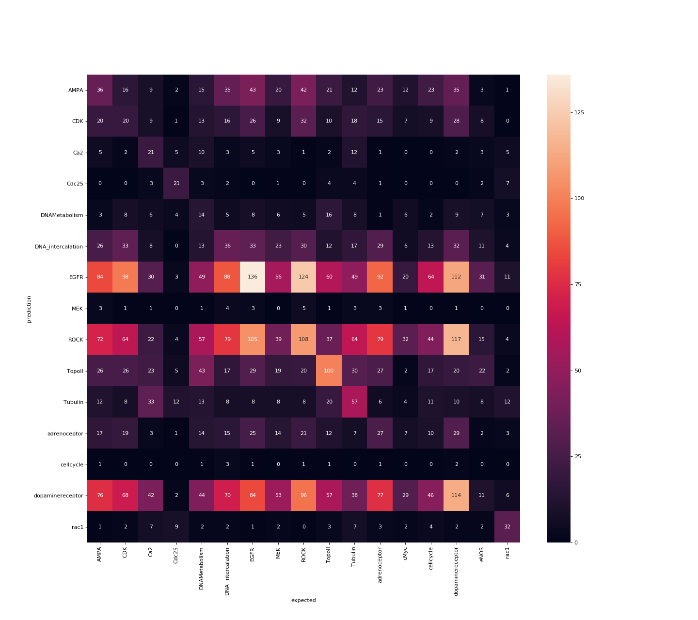

# Random Forest

A random forest, a collection of random generated decision trees, is a form of a classifier.
The classification always goes via a hard cut in a feature.
This work well if all features are independent.

## Naive Attempt

Using [Sklearn Random Forest Classifier](https://scikit-learn.org/stable/modules/generated/sklearn.ensemble.RandomForestClassifier.html) we trained an estimator on the [processed training data](../2.process-data/README.md).

### Parameters

- n_estimators=100
- criterion=’gini’
- max_depth=None
- min_samples_split=2
- min_samples_leaf=1
- min_weight_fraction_leaf=0.0
- max_features=’auto’
- max_leaf_nodes=None
- min_impurity_decrease=0.0
- min_impurity_split=None
- bootstrap=True
- oob_score=False
- n_jobs=None
- random_state=None
- verbose=0
- warm_start=False
- class_weight=None

### Experiment setup

We run a script to determine model performance and model stability. 
Every time the script is run another results in added to the list. 
These results show what the performance is (the mean) and how stable it get there (the variance).
This can be used to compare different models with each other and conclude if they have different stability.
All parameters are set to the default parameters.
The mean focus is to find out if there is a significant classification possible using the current features.

### Results Ebimage

The balanced f1-score on the validation set is [0.3449 ± 0.00594 with 21 model initializations](results_ebimage/all_scores.csv).
This is very low, but what is interesting is the [confusion matrix](results/0/confusion_matrix.png) (shown is one example initialization).
The predictions are dominated by 3 classes: dopaminereceptor, EGFR, ROCK.
When looking at the [most common classes](../2.process-data/results/target_counts.tsv) we find the same 3 classes.
When we look at the next 3 most common classes most common class (adrenoceptor, DNA_intercalation, AMPA) we see very few predictions. Almost all of these images are labeled as one of the 3 dominated classes.
There are a few classes (e.q. Ca2, Cdc25, eNos, rac1) are well predicted and seems to be easy cases.

Confusion matrix 0 of Ebimage

### results Eigen values

The balanced f1-score on the validation set is [0.128 ± 0.0111 with 5 model initializations](results_eigenvalue/all_scores.csv).
Comparing the results to those of Ebimage we see an overall worst result.
Comparing the diagonal of the two confusion matrices we see eigen value score lower by all but AMPA and CDK.

Confusion matrix 0 of eigen values

### results Eigen values with ebimage

The balanced f1-score on the validation set is [0.253 ± 0.0114 with 3 model initializations](results_ebimage+eigenvalue/all_scores.csv).
Comparing the results to those of Ebimage we see an overall worst result.
But higher as the eigen values.
Mostlikely this has to with with the 1967 features of the eigen values with [no significant difference](../2.process-data/scripts/html/2.1.analysing-eigen-values.html).
If the a random tree uses these to split the data it will decrease the result.
Give the higher number of useless (~1970) to usefull features (~60) features and the high number of tree (100) the change of this happening can be significant.

Confusion matrix 0 of eigen values

### results selected Eigen values with ebimage

For this experiment we only take the [significant eigen values](../2.process-data/scripts/html/2.1.analysing-eigen-values.html) with ebimage features.
The balanced f1-score on the validation set is [0.336 ± 0.0071 with 21 model initializations](results_ebimage+selected_eigenvalue/all_scores.csv).
Applying a student-t on the results of ebimage and these we get a p-value of 3.111e-13.
Meaning ebimage without the extra eigen values score significant better.
Comparing the best confusion matrix of the ebimage and selected eigen values + ebimage,
we see strong correlation with some only Ca2 as noteworthy better with eigen values + ebimage.

Confusion matrix 3 of eigen values

### Future Steps

- [ ] Parameter optimization. Try different parameters to find best solution
